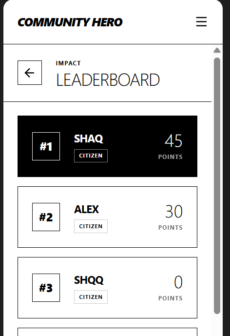

# Community Hero

Community Hero is a hyperlocal problem solver and civic issue reporting platform. It empowers citizens to report community issues, verifies their legitimacy with AI, and rewards community engagement.

**Note:** This project is designed as a mobile-first web application, with future plans to be ported into a native Android app.

## Citizen Dashboard
<video controls src="screen-recordings/20260630-1707-38.1538841.mp4" title="Title"></video>
## Features

### 📸 Civic Issue Reporting
- **Capture & Upload**: Users can capture photos of issues (potholes, garbage, broken infrastructure) directly through the app's camera interface or upload them.
- **Geolocation**: Automatically captures or allows manual input of coordinates to accurately pinpoint the issue location.


### 🤖 AI-Powered Verification
- **Spam Prevention**: Uses the Gemini 2.5 Flash API to automatically verify if the provided description matches the uploaded image before submission.
- **Intelligent Feedback**: Filters out invalid reports and provides specific reasons for rejection to maintain high data quality.

### 👥 Role-Based Access & Workflows
- **Citizen**: Reports issues, tracks personal impact, upvotes community issues, and earns points.
- **Verifier**: Reviews pending reports, and validates or rejects them (rejecting deducts points from the reporter to discourage spam).
- **Admin**: Oversees all reports via a comprehensive dashboard, views regional trends, and manages the platform.

## Verifier Dashboard

<video controls src="screen-recordings/20260630-1714-35.1314983.mp4" title="Title"></video>

## Admin Dashboard
<video controls src="screen-recordings/20260630-1717-16.6598974.mp4" title="Title"></video>


### 🗺️ Interactive Maps
- **Geospatial Visualization**: Integrates Google Maps Platform to visualize reported issues across different regions.
- **Location Focus**: Users and admins can explore issues on an interactive map, seeing clusters of problems geographically.

### 🏆 Gamification & Leaderboard
- **Points System (PTS)**: Users earn points for reporting valid civic issues, promoting active participation in community upkeep.
- **Leaderboards**: Highlights top contributors in the community.
- **Points History**: Users can view a detailed log of their contributions and impact over time.

## Leaderboard


### 📈 Predictive Analysis & Regional Trends
- **Trend Spotting**: Highlights areas (zones) with a high frequency of specific issues (e.g., Water Supply, Infrastructure).
- **AI Insights**: Generates predictive analysis on underlying infrastructural stress based on reporting frequency, allowing city planners to be proactive.

### 💬 AI Assistant Chatbot
- **Interactive Helper**: An integrated chatbot that assists users with app navigation, reporting guidelines, and general community queries. Integrated agentic system that can access user's screen whenever it needs to.

## Tech Stack

- **Frontend**: React 19, Vite, Tailwind CSS, Motion (animations)
- **Backend**: Node.js, Express
- **Database**: Firebase Firestore (for storing users, complaints, and points history)
- **AI / Machine Learning**: Google GenAI SDK (Gemini 2.5 Flash)
- **Maps**: Google Maps API (`@vis.gl/react-google-maps`)

## Prerequisites

To run this project locally, you need the following environment variables defined in a `.env` file:

```env
GEMINI_API_KEY=your_gemini_api_key
GOOGLE_MAPS_PLATFORM_KEY=your_google_maps_platform_key
GOOGLE_MAPS_API_KEY=your_google_maps_api_key
```

You also need to have Firebase configured properly for database interactions.

## Setup Instructions

1. **Install dependencies:**
   ```bash
   npm install
   ```

2. **Start the development server:**
   ```bash
   npm run dev
   ```

3. **Build for production:**
   ```bash
   npm run build
   ```

4. **Start the production server:**
   ```bash
   npm start
   ```

## Architecture

This is a full-stack application:
- The frontend is built as a Single Page Application (SPA) using React.
- The backend uses Express to proxy API requests (e.g., verifying issues, chatbot) and securely use the Gemini API key without exposing it to the client.
- The server is configured to run and handle both API routes and static file serving for production.
